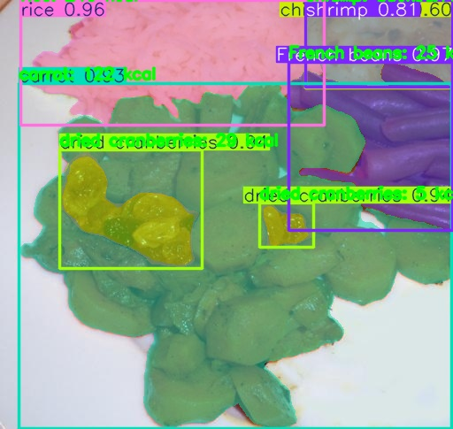
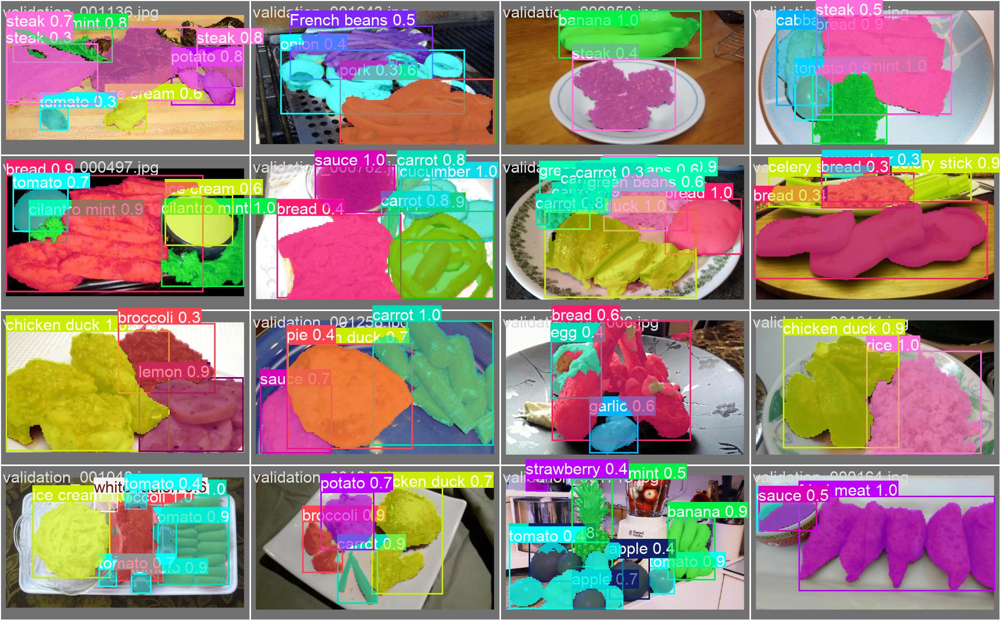
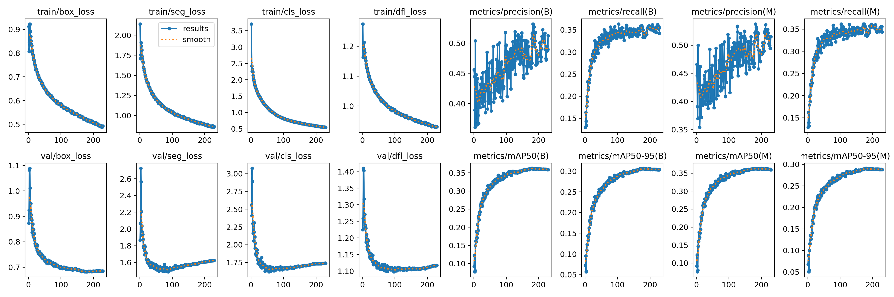
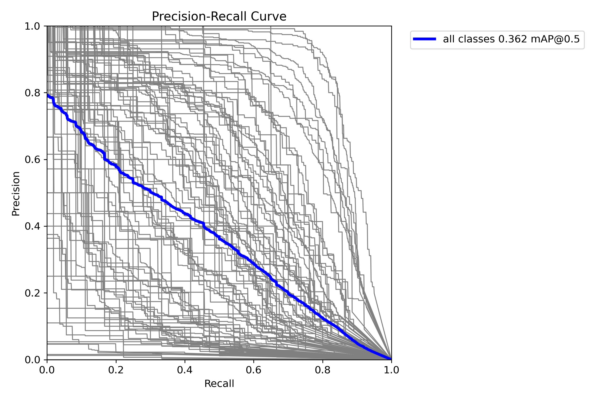

# FoodSeg-YOLO11: AI-Powered Food Instance Segmentation & Calorie Estimation

[](https://www.python.org/)
[](https://github.com/ultralytics/ultralytics)
[](https://pytorch.org/)
[](https://huggingface.co/datasets/EduardoPacheco/FoodSeg103)
[](LICENSE)

> **AI-based Real-Time Food Calorie Estimation on Mobile & Edge Devices using YOLO11-seg**  
> *Developed as a Senior Project (CS461) by **Atipong Sena** (ID: 1650708579)*

---

## 📌 Overview

Accurate dietary tracking is essential for fitness management, personalized nutrition, and clinical dietary interventions (e.g., diabetes, hyperlipidemia). However, traditional manual calorie logging is tedious, error-prone, and unsustainable for most users.

**FoodSeg-YOLO11** is an end-to-end computer vision and dietary assessment framework that automates food recognition and nutritional quantification directly from images and real-time video streams:

1. **Instance Segmentation**: Employs **YOLO11-seg** (`yolo11s-seg` / `yolo11n-seg`) trained on **FoodSeg103** (103 food ingredient categories).
2. **Volumetric & Weight Estimation**: Maps polygonal pixel mask contours to real-world metric surface area ($\text{cm}^2$), applies depth/thickness approximations ($\text{cm}$), and calculates physical mass ($g$) using food-specific densities ($\text{g/cm}^3$).
3. **Calorie & Macro Computation**: Calculates total and itemized caloric values ($\text{kcal}$) referencing comprehensive nutritional lookup metadata.
4. **Edge & Mobile Ready**: Supports export to **ONNX**, **TFLite**, and **CoreML** for lightweight, offline, privacy-preserving on-device execution.

---

## 🖼️ Demo & Visual Results

### Sample Calorie Inference
Below is a demonstration of real-time multi-ingredient detection, segmentation masks, bounding boxes, and instant caloric estimation:



### Validation Predictions & Ground Truth


---

## 🧮 Calorie Estimation Methodology

```
┌─────────────────┐     ┌─────────────────────┐     ┌───────────────────────┐
│ Input Image /   │ ──> │ YOLO11-seg Instance │ ──> │ Pixel Mask Extraction │
│ Video Stream    │     │ Segmentation Model  │     │ & Scale Calibration   │
└─────────────────┘     └─────────────────────┘     └───────────┬───────────┘
                                                                │
┌─────────────────┐     ┌─────────────────────┐     ┌───────────▼───────────┐
│ Total & Per-Item│ <── │ Density & Nutrition │ <── │ Surface Area (cm²) &  │
│ Calories (kcal) │     │ Lookup (JSON)       │     │ Volume (cm³) Estimate │
└─────────────────┘     └─────────────────────┘     └───────────────────────┘
```

The calorie calculation pipeline operates through the following mathematical formulation:

1. **Scale Resolution Factor ($S$)**:
   $$S = \frac{D_{\text{real}}}{D_{\text{px}}} \quad (\text{cm/pixel})$$
   where $D_{\text{real}}$ is a known reference object diameter (e.g., plate size $\approx 24\text{--}27\text{ cm}$) and $D_{\text{px}}$ is its measured pixel span.

2. **Real-World Surface Area ($A$)**:
   $$A = N_{\text{pixels}} \times S^2 \quad (\text{cm}^2)$$
   where $N_{\text{pixels}} = \sum \mathcal{M}_{i,j}$ from the binary segmentation mask $\mathcal{M}$.

3. **Volumetric Approximation ($V$)**:
   $$V = A \times h_{\text{assumed}} \quad (\text{cm}^3)$$
   where $h_{\text{assumed}}$ is the item/class thickness profile (default: $1.5\text{ cm}$).

4. **Mass ($W$) and Energy ($E$)**:
   $$W = V \times \rho_{\text{food}} \quad (\text{grams})$$
   $$E = \frac{W \times C_{100g}}{100} \quad (\text{kcal})$$
   where $\rho_{\text{food}}$ is ingredient density ($\text{g/cm}^3$) and $C_{100g}$ is energy density ($\text{kcal}/100\text{g}$).

---

## 📊 Dataset: FoodSeg103

The model is trained on the **FoodSeg103** benchmark:
- **Total Images**: 7,118 images (Train: ~4,983, Val: ~2,135)
- **Categories**: 103 distinct food, ingredient, and recipe classes (e.g., steak, chicken, rice, pasta, tofu, vegetables, fruits, sauce).
- **Format**: Semantic pixel masks converted into YOLO polygonal instance segmentation coordinates via [`pre-dataset.py`](pre-dataset.py).

---

## 📈 Model Performance & Training Metrics

Trained on `yolo11s-seg` architecture with cosine learning rate scheduling over 230+ epochs:

| Metric | Bounding Box (B) | Mask / Segmentation (M) |
| :--- | :---: | :---: |
| **Precision** | **51.2%** | **51.5%** |
| **Recall** | **34.3%** | **34.4%** |
| **mAP@50** | **35.9%** | **35.9%** |
| **mAP@50-95** | **30.4%** | **28.8%** |

### Training Loss & mAP Curves


### Precision-Recall Curve (Mask PR)


---

## 📁 Repository Structure

```
FoodSeg-YOLO11-Calorie-Estimation/
├── assets/                       # Demo output images and evaluation plots
│   ├── demo_inference.jpg
│   ├── results.png
│   ├── MaskPR_curve.png
│   ├── confusion_matrix.png
│   └── val_batch0_pred.jpg
├── runs/                         # Model training outputs and checkpoints
│   └── segment/
│       └── yolo11s-foodseg103/
│           ├── weights/best.pt   # Best trained YOLO11s-seg weights
│           └── results.csv       # Training epoch metrics log
├── samples/                      # Sample food images for testing
│   └── sample_meal.jpg
├── calorie_inference.py          # CLI for image-based food calorie estimation
├── video_inference.py            # CLI for real-time video/webcam calorie tracking
├── YOLO11-seg.py                 # YOLO11 segmentation training & export script
├── pre-dataset.py                # Dataset download & mask-to-YOLO converter
├── foodseg103.yaml               # YOLO dataset configuration file
├── calorie_metadata.json         # Nutritional density & calorie database (103 classes)
├── requirements.txt              # Project dependencies
├── .gitignore                    # Git ignore file for large datasets and binaries
└── README.md                     # Project documentation
```

---

## 🚀 Quick Start

### 1. Installation

Clone the repository and install dependencies:

```bash
git clone https://github.com/atipongsena/FoodSeg-YOLO11-Calorie-Estimation.git
cd FoodSeg-YOLO11-Calorie-Estimation

# Create virtual environment (optional but recommended)
python -m venv .venv
# On Windows:
.venv\Scripts\activate
# On Linux/macOS:
source .venv/bin/activate

# Install requirements
pip install -r requirements.txt
```

### 2. Run Image Calorie Estimation

Run inference on a single image or directory with automatic calorie estimation and visualization:

```bash
python calorie_inference.py \
  --weights runs/segment/yolo11s-foodseg103/weights/best.pt \
  --source samples/sample_meal.jpg \
  --metadata calorie_metadata.json \
  --save-vis outputs/vis \
  --save-json outputs/meal_calories.json \
  --reference-object-cm 26 \
  --reference-object-px 400
```

**Output Example:**
```text
Source: samples/sample_meal.jpg
  Total calories: 685.6 kcal
  Total weight  : 740.3 g
    - French beans           24.8 kcal |   70.9 g | area    78.8 cm^2
    - rice                  239.6 kcal |  126.1 g | area   120.1 cm^2
    - dried cranberries      34.0 kcal |   56.8 g | area    47.2 cm^2
    - carrot                122.3 kcal |  349.5 g | area   388.3 cm^2
    - shrimp                 91.4 kcal |   70.3 g | area    52.1 cm^2
    - chicken duck          173.3 kcal |   66.7 g | area    52.3 cm^2

Saved calorie summary to outputs/meal_calories.json
Saved annotated visualizations to outputs/vis
```

### 3. Run Real-Time Video / Webcam Stream

Process video files or live camera feeds with real-time on-screen calorie statistics:

```bash
# For a video file
python video_inference.py \
  --weights runs/segment/yolo11s-foodseg103/weights/best.pt \
  --source path/to/video.mp4 \
  --output outputs/video_result.mp4

# For Live Webcam (index 0)
python video_inference.py \
  --weights runs/segment/yolo11s-foodseg103/weights/best.pt \
  --source 0 \
  --show
```

---

## 🛠️ Dataset Preparation & Model Training

### Prepare FoodSeg103 Dataset
Download and transform Hugging Face semantic masks into YOLO polygon segment annotations:

```bash
python pre-dataset.py
```

### Train YOLO11-seg
Train the model with GPU acceleration:

```bash
python YOLO11-seg.py
```

### Model Export for Edge & Mobile Deployment
Export trained weights to optimized inference engines:

```python
from ultralytics import YOLO

model = YOLO("runs/segment/yolo11s-foodseg103/weights/best.pt")

# Export to ONNX (dynamic batch for server/desktop/Android)
model.export(format="onnx", imgsz=640, dynamic=True)

# Export to TensorFlow Lite (for Android / Edge TPU)
model.export(format="tflite", imgsz=640)

# Export to Apple CoreML (for iOS / macOS)
model.export(format="coreml", imgsz=640)
```

---

## ⚙️ Customizing Nutritional Assumptions

Nutritional values and physical density parameters can be fine-tuned in [`calorie_metadata.json`](calorie_metadata.json):

```json
{
  "assumed_thickness_cm": 1.5,
  "default": {
    "calories_per_100g": 180.0,
    "density_g_per_cm3": 0.75
  },
  "classes": {
    "rice": {
      "calories_per_100g": 130.0,
      "density_g_per_cm3": 0.85
    },
    "steak": {
      "calories_per_100g": 271.0,
      "density_g_per_cm3": 1.05
    }
  }
}
```

---

## 📚 References & Acknowledgments

- **FoodSeg103 Dataset**: [Eduardo Pacheco / FoodSeg103 on Hugging Face](https://huggingface.co/datasets/EduardoPacheco/FoodSeg103) & [Large-scale Food Segmentation Paper](https://arxiv.org/abs/2105.05409)
- **YOLO11**: [Ultralytics YOLO11 Repository](https://github.com/ultralytics/ultralytics)
- **Advisor & Institution**: Computer Science Senior Project (CS461).

---

## 📄 License

This project is licensed under the [MIT License](LICENSE).
